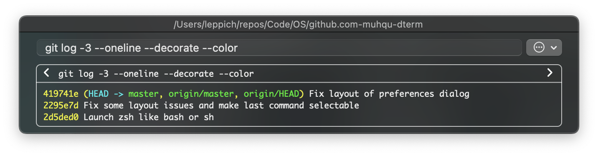

# DTerm 


***A command line anywhere and everywhere***

Command line work isn't a separate task that should live on its own—it's an integrated part of your natural workflow. DTerm provides a context-sensitive command line that makes it fast and easy to run commands on the files you're working with and then use the results of those commands.

<br break="both">

# How does it look?



# How to get it?

For drag'n-drop installable DMG images, see the [releases][] section on GitHub.

# Ghostty

DTerm uses Ghostty automatically when it is installed at
`/Applications/Ghostty.app/Contents/MacOS/ghostty`.

Press `⌘↩` to copy `cd <directory>` to the clipboard and bring Ghostty to the
front. Paste and run it in Ghostty if desired. If Ghostty is not running,
DTerm opens it normally. Set `DTERM_TERM` to override the terminal executable.

# How to build it yourself?

``` sh
git clone git://github.com/muhqu/dterm
cd ./dterm
./build.sh --with-dmg
```


# License

[The MIT License (MIT)](./LICENSE).

---

Copyright © 2004-2013 [Decimus Software, Inc][decimus].

"DTerm" and "Decimus" are either trademarks or registered trademarks of [Decimus Software, Inc][decimus].

[releases]: https://github.com/NicHub/dterm/releases
[decimus]: http://decimus.net
